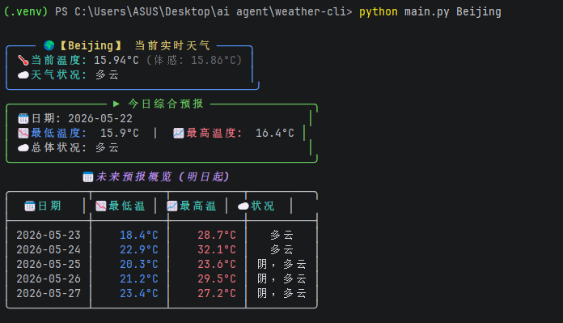

# Weather CLI App Dashboard



A beautiful and modern command-line weather application built with Python, the OpenWeatherMap API, and the `rich` library for terminal rendering.

This project allows users to:

- Check the current weather of a city with a visually appealing UI
- View today's comprehensive forecast (High/Low temps)
- View a 5-day weather forecast table (starting from tomorrow)
- Handle invalid city names and network errors gracefully
- Securely manage API keys using `.env` files

---

# Features

- **Beautiful Terminal UI**: Uses `rich` for colorful panels, tables, and structured layouts.
- **Real-time weather data**: Current temperature, "feels like" temperature, and weather conditions.
- **Smart Forecast Logic**: Separates today's forecast from the future days, providing a cleaner overview.
- **Secure Configuration**: Uses `python-dotenv` to keep API keys out of source code.
- **Chinese language support**: Weather descriptions are localized.
- **Robust Error Handling**: Friendly error messages for missing parameters, bad API keys, or network issues.

---

# Technologies Used

- Python 3
- `requests` (API calls)
- `rich` (Terminal formatting and UI)
- `python-dotenv` (Environment variable management)
- OpenWeatherMap API

---

# Installation

Clone the repository:

```bash
git clone git@github.com:zhoulinhua0-star/weather-cli.git